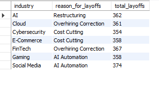
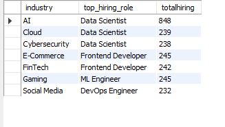
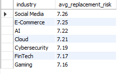
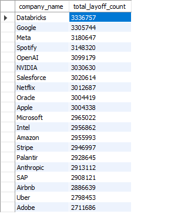
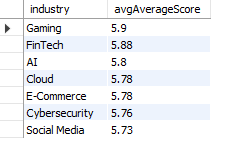
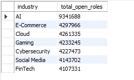
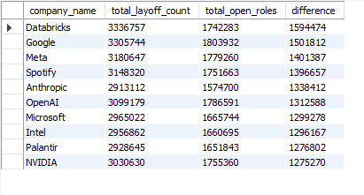
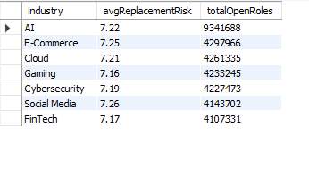
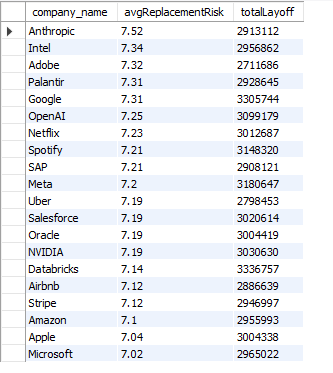
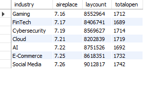

# Tech Layoffs & Hiring Trends 2026 SQL Analytics Project
A data analytics project exploring workforce trends, AI displacement risk, and hiring patterns across the tech industry using SQL.

---

## Dataset

- **Source:**[ [Kaggle — Tech Layoffs & Hiring Trends 2026](https://www.kaggle.com/)](https://www.kaggle.com/datasets/amaymishra11/tech-layoffs-and-hiring-trends-2026)
- **Table used:** `tech_layoffs`
- **Key columns:** `industry`, `company_name`, `reason_for_layoffs`, `top_hiring_role`, `ai_replacement_risk`, `layoffs_count`, `open_roles`, `job_security_score`
---

##  Tools Used

- **Database:** MySQL 
- **Query tool:** MySQL Workbench
- 
---

## Business Questions

| # | Question |
|---|----------|
| 1 | What is driving workforce reductions across different tech sectors? |
| 2 | Which roles are companies actively prioritizing in each sector despite market conditions? |
| 3 | How exposed is each industry to having its workforce replaced by AI systems? |
| 4 | Which specific companies have cut the most jobs, and how do they compare to peers? |
| 5 | Which industries offer the most stable employment outlook for workers? |
| 6 | Where are the most and fewest job opportunities currently available? |
| 7 | Are companies simultaneously cutting and hiring and what does that signal about their strategy? |
| 8 | Do industries with higher AI risk still generate job openings, or does automation suppress hiring? |
| 9 | Does a company's AI exposure directly predict how many workers it will cut? |
| 10 | Where should job seekers focus for the most stable and opportunity-rich career path? |

---

## 📋 Findings

---

**1. Business Question:** What is driving workforce reductions across different tech sectors?

**SQL Query:**
```sql
WITH layoffs_reason AS (
    SELECT industry,
           reason_for_layoffs,
           COUNT(*) AS total_layoffs,
           ROW_NUMBER() OVER (
               PARTITION BY industry
               ORDER BY COUNT(*) DESC
           ) AS rn
    FROM tech_layoffs
    GROUP BY industry, reason_for_layoffs
)

SELECT industry,
       reason_for_layoffs,
       total_layoffs
FROM layoffs_reason
WHERE rn = 1;
```

**Results:**



**Key Finding:** Social Media leads with 374 layoffs driven by AI Automation. FinTech and Cloud cite Overhiring Correction (367 and 361 respectively). Cybersecurity and E-Commerce are driven by Cost Cutting.

**Insight:** Industries closer to AI adoption (Social Media, Gaming) are losing jobs to automation, while sectors that over-expanded during 2020–2022 (FinTech, Cloud) are simply right-sizing their workforce — not being replaced by technology.

---


**2. Business Question:** Which roles are companies actively prioritizing in each sector despite market conditions?

**SQL Query:**
```sql
WITH hiring_role AS (
    SELECT industry,
           top_hiring_role,
           COUNT(*) AS totalhiring,
           ROW_NUMBER() OVER (PARTITION BY industry ORDER BY COUNT(*) DESC) AS rn
    FROM tech_layoffs
    GROUP BY industry, top_hiring_role
)
SELECT industry, top_hiring_role, totalhiring
FROM hiring_role
WHERE rn = 1;
```

**Results:**



**Key Finding:** Data Scientist dominates AI (848 hires), Cloud, and Cybersecurity. Frontend Developer leads E-Commerce and FinTech. ML Engineer tops Gaming; DevOps Engineer leads Social Media.

**Insight:** Data Scientist is the most universally in-demand role across tech  especially in AI, where hiring volume is nearly 3.5× higher than any other industry. Job seekers with data skills have the widest range of industry options available to them.

---


**3. Business Question:** How exposed is each industry to having its workforce replaced by AI systems?

**SQL Query:**
```sql
SELECT industry,
       ROUND(AVG(ai_replacement_risk), 2) AS avg_replacement_risk
FROM tech_layoffs
GROUP BY industry
ORDER BY avg_replacement_risk DESC;
```

**Results:**



**Key Finding:** Social Media has the highest AI risk at 7.26. E-Commerce follows at 7.25, AI at 7.22. Gaming is the lowest at 7.16 — but the overall spread is very narrow (7.16–7.26).

**Insight:** The narrow range across all industries suggests AI replacement risk is a sector-wide threat, not isolated to one area. No industry is truly "safe" from automation pressure, the entire tech landscape faces comparable risk levels.

---


**4. Business Question:** Which specific companies have cut the most jobs, and how do they compare to peers?

**SQL Query:**
```sql
SELECT company_name,
       SUM(layoffs_count) AS total_layoff_count
FROM tech_layoffs
GROUP BY company_name
ORDER BY total_layoff_count DESC;
```

**Results (Top 10):**



**Key Finding:** Databricks leads all companies at 3,336,757 total layoffs. Google (3.3M), Meta (3.18M), and Spotify (3.15M) follow closely. Microsoft and Apple rank lower at ~2.96M–3M.

**Insight:** Surprisingly, Databricks — an AI-native company — tops layoff counts, which contradicts the assumption that AI companies are only hiring. Even high-growth AI firms are restructuring internally, suggesting role transformation rather than pure expansion.

---


**5. Business Question:** Which industries offer the most stable employment outlook for workers?

**SQL Query:**
```sql
SELECT industry,
       ROUND(AVG(job_security_score), 2) AS avgAverageScore
FROM tech_layoffs
GROUP BY industry
ORDER BY avgAverageScore DESC;
```

**Results:**



**Key Finding:** Gaming scores highest at 5.9, followed by FinTech at 5.88. AI and Cloud sit mid-range at 5.8 and 5.78. Social Media is the lowest at 5.73.

**Insight:** Gaming's top job security score is notable given its mid-tier AI risk — suggesting the industry retains human creative talent despite automation pressure. Social Media's lowest security score aligns with its highest AI automation layoffs (Q1), confirming a consistent risk signal for that sector.

---


**6. Business Question:** Where are the most and fewest job opportunities currently available?

**SQL Query:**
```sql
SELECT industry,
       SUM(open_roles) AS total_open_roles
FROM tech_layoffs
GROUP BY industry
ORDER BY total_open_roles DESC;
```

**Results:**



**Key Finding:** The AI industry has the most open roles at 9,341,688 which is more than double the next industry. FinTech has the fewest open roles at 4,107,331.

**Insight:** AI's open roles signal massive demand that current talent supply cannot meet. FinTech's low open roles combined with its Overhiring Correction layoffs (Q1) suggests the sector has reached its hiring ceiling and is now in consolidation mode.

---


**7. Business Question:** Are companies simultaneously cutting and hiring, and what does that signal about their strategy?

**SQL Query:**
```sql
SELECT company_name,
       SUM(layoffs_count) AS total_layoff_count,
       SUM(open_roles) AS total_open_roles,
       SUM(layoffs_count) - SUM(open_roles) AS difference
FROM tech_layoffs
GROUP BY company_name
ORDER BY total_layoff_count DESC,
         total_open_roles DESC,
         difference ASC;
```

**Results (Top 5):**



**Key Finding:** Every major company in the dataset shows high layoffs alongside significant open roles. Databricks shows one of the largest simultaneous hire-and-fire behaviors (3.37M layoffs, 1.74M open roles).

**Insight:** These paradox companies are not shrinking — they are transforming. They are cutting legacy or generalist roles while aggressively hiring specialized talent. Job seekers should actively target these companies as they represent high demand for the right skill set.

---


**8. Business Question:** Do industries with higher AI risk still generate job openings, or does automation suppress hiring?

**SQL Query:**
```sql
SELECT industry,
       ROUND(AVG(ai_replacement_risk), 2) AS avgReplacementRisk,
       SUM(open_roles) AS totalOpenRoles
FROM tech_layoffs
GROUP BY industry
ORDER BY totalOpenRoles DESC;
```

**Results:**



**Key Finding:** The AI industry has the highest open roles (9.3M) with a mid-range AI risk (7.22). Social Media has the highest AI risk (7.26) yet still maintains 4.14M open roles. No strong inverse correlation is visible in the data.

**Insight:** High AI risk does not suppress hiring but it changes the type of hiring. Industries under AI pressure still need human workers to build, manage, and operate AI systems. The assumption that "AI replaces = fewer jobs" is not supported by this data.

---


**9. Business Question:** Does a company's AI exposure directly predict how many workers it will cut?

**SQL Query:**
```sql
SELECT company_name,
       ROUND(AVG(ai_replacement_risk), 2) AS avgReplacementRisk,
       SUM(layoffs_count) AS totalLayoff
FROM tech_layoffs
GROUP BY company_name
ORDER BY avgReplacementRisk DESC;
```

**Results (Top 5 by AI Risk):**



**Key Finding:** Anthropic has the highest AI risk (7.52) but is not the top in layoffs. Databricks leads in layoffs (3.3M) at only 7.14 risk. Apple and Microsoft have the lowest AI risk scores (7.02–7.04) yet still rank in the top layoff counts.

**Insight:** AI replacement risk alone does not predict layoff volume. Layoffs are driven by broader business strategy like restructuring, cost management, and over-hiring corrections and not just automation risk. Macro business cycles are the real driver of layoff volume.

---


**10. Business Question:** Where should job seekers focus for the most stable and opportunity-rich career path?

**SQL Query:**
```sql
SELECT industry,
       ROUND(AVG(ai_replacement_risk), 2) AS aireplace,
       SUM(layoffs_count) AS laycount,
       COUNT(open_roles) AS totalopen
FROM tech_layoffs
GROUP BY industry
ORDER BY aireplace ASC,
         laycount ASC,
         totalopen DESC;
```

**Results:**



**Key Finding:** Gaming ranks best overall as lowest AI risk (7.16) and among the lowest layoff counts (8.55M). FinTech is second with risk 7.17. Social Media ranks worst on all three dimensions combined.

**Insight:** Gaming and FinTech emerge as the most balanced industries for job stability. Gaming's reliance on human creativity limits full automation, while FinTech's regulatory environment requires human oversight. Job seekers prioritizing long-term stability should target these two sectors — especially in ML Engineer (Gaming) and Frontend Developer (FinTech) roles identified in Q2.

---

## Overall Conclusions

 **AI and automation are reshaping and not eliminating the job market.** 
**Social Media is the most at-risk industry**
**Gaming and FinTech offer the best stability balance** 
 **Data Scientist is the most universally in-demand role**
 **Paradox companies (Databricks, OpenAI, Google) are transforming, not shrinking**
 **AI risk does not directly cause more layoffs.** 

---

## Project Structure

```
Tech_Layoffs_SQL_Analysis/
├── README.md               ← This file
├── queries/
│   ├── 01_layoff_reasons.sql
│   ├── 02_top_hiring_roles.sql
│   ├── 03_ai_replacement_risk.sql
│   ├── 04_layoff_count_per_company.sql
│   ├── 05_job_security_per_industry.sql
│   ├── 06_open_roles_per_industry.sql
│   ├── 07_paradox_companies.sql
│   ├── 08_ai_risk_vs_open_roles.sql
│   ├── 09_ai_risk_vs_layoffs.sql
│   └── 10_safest_industry.sql
└── results/
    └── screenshots/
```

---

## Author

Made by Rui Manalo · [LinkedIn](www.linkedin.com/in/rui-manalo-71350a376), [Portfolio](https://www.datascienceportfol.io/ruicourse3/projects/0)
